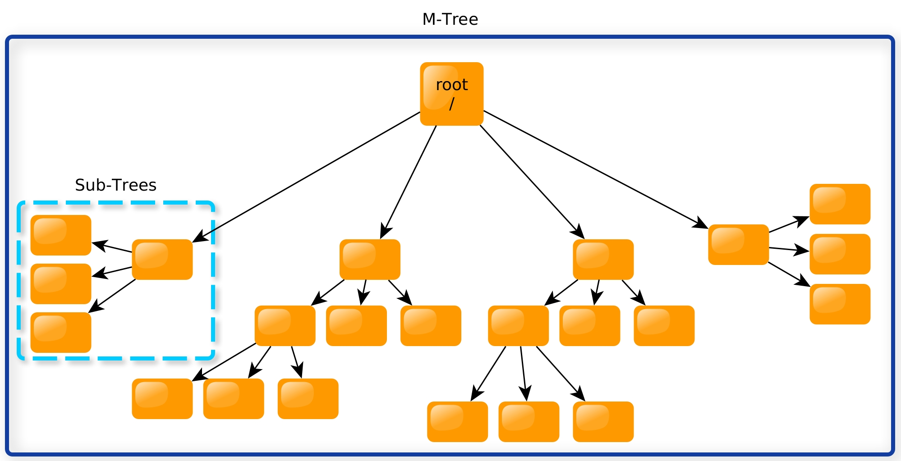
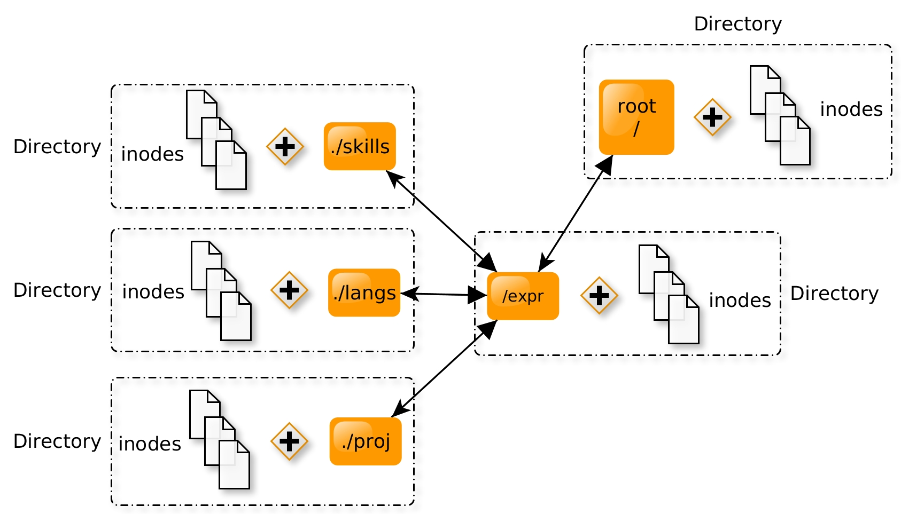
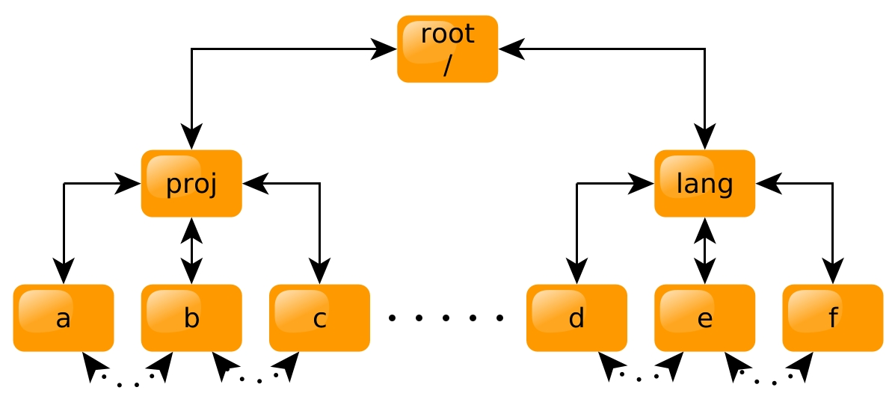
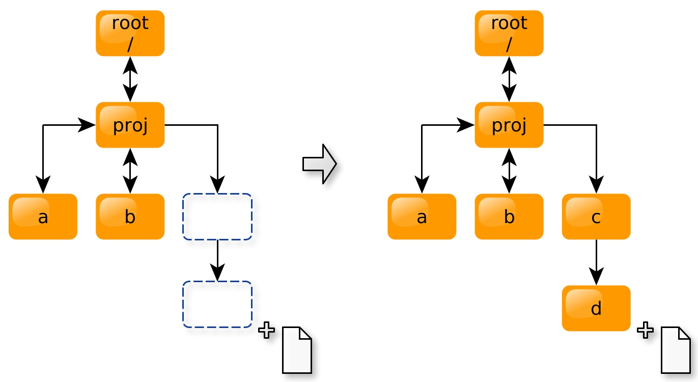

**jayVFS** is somewhere between a `B+ Tree` and a `Doubly Linked List` (very roughly speaking). I've named it an `M-Tree`, since I couldn't think of anything else (After some research I found out that there is another structure, also called [m-tree](https://en.wikipedia.org/wiki/M-tree), but it was too late to change the name to something that is not taken...)



Here is the basic layout of the Tree. We have a root node, where below it, we find many nodes and leaf-nodes connected to the root.

The `M-Tree` simulates the `UNIX` FS tree structure. It is also made to have both lateral and horizontal access to all child, parent, and sibling nodes. Now what that means is that, there is not only a side access to all nodes (left and right), but there is also lateral movement up and down the tree, to all parent and child nodes. The reason this was implemented was because virtual file systems have a concept of **relative paths**. Now there are several approaches as to how to tackle relative paths, but having a complete relative access to all nodes from any give point, serves as a good solution. This can potentially cut down on search times. Since another approach would be to brute force every single possible path to the relative destination.

The `M-Tree` also has nodes, serving as leaf nodes, which are aptly named - `inodes`. The `inodes` hold the following data inside - the name of the actual file and its contents in plain text. For now, the `inode` only stores plain text.



We can see that all of the tree objects, both the root and the children, can have an expanding number of files in each tree. Furthermore, we also see that one directory comprises of two things, a tree object, which would hold both subsequent directories, and one or more `inodes`. In this specific picture, it's demonstrated that there is only one **root**, holding a couple of files and one child directory. The child dir, named `expr`, also has a couple of files and *3* sub-directories. Each of which hold many files, are called differently, and are also *siblings* to one another. This would mean that `./skills`, `./langs` and `./proj` are siblings, sharing one parent - `./expr`, and one great parent - `root`. The cool thing about this, as we will see shortly, is that all of these places and files can be reached in a relative and optimal manner.

The `jayVFS` class wraps around this *ADT* and implements an inner working `API`, allowing for creating, deleting, searching and retrieving files and directories. In addition, this class also maps the directories that the user has specified, and returns some other needed information, such as the *root node*, the contents of any specified directory, the currently visited directory, and many other functionalities.

When we open any terminal emulator, we have a wide range of commands are our disposal that we can play around with. In this case, since the data is stored on an emulated FS, it makes sense that the commands that are implemented, would also interact with the `VFS`. In term, here are the set of commands that have been developed to work with the whole structure:

`ls` - Lists directory contents. \
`rm` - Remove a target file. \
`cd` - Changes the working directory. \
`pwd` - Prints name of current/working directory. \
`cat` - Concatenates files and print on the standard output. \
`date` - Prints or set the system date and time. \
`echo` - Displays a line of text. Can also add or append data to a file. \
`help` - Prints help, or, if specified, prints a specific help listing of a command. \
`mkdir` - Makes a specified directory. \
`rmdir` - Removes a specified directory. \
`touch` - Creates a file. \

Here are how some of the things work underneath:

**Tree traversal**: An array, consisting of the destination path, is passed. Then for each sequential part of the whole array, starting from its first element, is checked whether that element exists as a `sub-tree` in the currently visited directory, starting from the root node. If such a sub-directory exists, then the tree object moves to that node and repeats the same task with the remaining destination arguments of the array. If no such directory exists, then an error is throw, with the appropriate message.

**Relative path resolution**: Takes in a string argument and passes it to a path resolution function. First, do an absolute path check. An absolute path is any path that starts from the root node and has some end destination, which is logically connected to the root in a valid manner. Basically, if the passed argument does indicated such a path, then it just skips the whole resolution and passes it on to the appropriate command. We can check if a path is absolute or not, by checking if the passed argument starts with a forwards slash - `/`. The logic behind this is that, even if we are at root level, that doesn't mean we are not going to use a relative path. So the only way to be sure that the string indicates something absolute is, if it starts with that `/` symbol. If this test fails, then we have to navigate appropriately to the needed destination. Relative path navigation uses two specific symbols - a single or a double dot, e.g. `.` would represent the current directory and `..` would represent the parent directory. Any child directory representation is made via the child directory name. There are **eight** cases in total to be handled here:

1. The path starts with a single dot (`.`). This would force us to start working from our currently visited directory.
2. The path starts with a double dot (`..`). This would force is to start working from our parent directory, prior to our current one.
3. The path starts with a forward slash and a dot (`/.`). This indicates that we want to start from the absolute path of the tree and then access it's current contents. This would be logically equivalent to `/`.
4. The path starts with a forward slash and a double dot (`/..`). This indicates that we want to start from the root path of the tree and then go out step above it. Although this makes no practical sense, it is still a valid way to represent a path in a `UNIX` system.
5. The path is blank. If we get a blank input we have to assume that this means that the path starts from the currently visited directory.
6. The path starts with a name of a file or directory. If this is the case, then as the above situation, we make the assumption that we are working from the current directory and then we continue on to resolve the rest of the path. There is a caveat here tho - if we are in the **root** level, then we must explicitly tell the algorithm to start traversing from it, otherwise it would get confused as to which is the current working dir.
7. The path starts with a forward slash and a word (`/thingshere`). This indicates that we want to start out traversal from the *root* node and then continue on from it.
8. The path starts only with a forward slash (`/`). This is simply indicating the *root* node as a starting point.

All of these things would make up for very strange use cases, where simultaneous forward and backwards navigation would be required. Depending on the position of the relative dots notation, we simply move for each part of the relative path array, to the desired directory, and then we repeat this step for every element till the end of the array. In the end we get a *full path*, that navigates to the desire directory, *if* it exists. Here we are utilizing the ability to see what the parent, or the child of the parent node is. This backwards and side peek of a sub-tree, allows us to quickly navigate to a nearby destination, without having to traverse the whole tree several times from the **root**, in order to find the needed directory. A good question would be - how do we know the concept of a parent and sibling node? We know this information in the tree, because, every time we *create* a directory, that `sub-tree`, the object that holds more directories and files, has both a parent node and it's full path as data members. This allows us to access that information on the go, without having to compute it each time. Only once is enough, when we create the needed dir (Although it's not even computed then, since we just retrieve it with each recursive iteration).

Let's take an example. If the user would pass this argument `/experience/projects/` and if we taken it as a given that all of the directories exist in that argument (namely `experience` and `projects`), and we assume that the directory `experience` is in the *root* of the whole system, then this would be considered as a *full path* and we would navigate to it directly. Then from that end directory (that would mean that we are now in the `projects` directory, which is in the `experience` one), if we navigate with this argument `../skills`, then we would be doing a *relative move backwards* and then one *forwards*. The `..` would indicate that we have to move one parent dir back, and then search in that parent, for a directory called skills. The end result would be an argument that would comprise of the full path to the `skills` sub-tree, which in this case would be `/experience/skills`. This would then be passed to the move command and we would find ourselves in that end destination. Navigating to files would be done in a very similar way.



Here is a diagrammatic view of this whole process. As we can see, each node is interconnected to the one next to it, and vise versa. For instance, going from `a` to `b` would be simple. All we need to know is that the parent of `a` - `proj`, also is the parent of `b`. Then if we search for `b` in `proj` and find it, we can access and even *go* to `b`. This would be much more efficient than to simply go to each directory, starting from the root, and then making a comparison in order to find what we are looking for. Of course there are some cases, where we have to reach all the way back to the **root**, since our destination is on the other side of the tree. This would be the case where `c` want's to *"see"* `d`.

As a final note, here is an extravagant example that should work. If we take the previous examples mapping, the following argument should be evaluated to a real path and then executed:

``` bash
cd ./awards/../awards/.././education
```

This, by no means of the imagination, is a smart way to navigate places, but by standard `UNIX` functionality, it must work!

**Directory and file mappings**: There is a possibility to configure some directories and files beforehand. In the `.conf` file, you can layout a basic tree structure. Additionally, you can also specify what files you want to have. The only requirement is to acutally have those files with the same name in the `contents` folder. That configuration file has a basic mapping on where the needed directories and files need to be. If the mappings have been correctly addressed, then all of the files on the host system are found and loaded into memory. Then they are mapped in the `VFS` accordingly and are made available for reading and writing. When the mapping of the files is loaded by the system, for every directory that does not exist, it is created on the spot. If a file is in a directory that does not exist, then that dir is also created on the spot.

Let's look at an example. If we have specified that we want to have the following directories present:

`sub_directories = /edu /exp /exp/projects /exp/skills /cat_pics` (space separated)

and the following files:

`files = /edu/edu.txt /exp/projects/my_projects.txt /exp/skills/icanjuggle.txt /exp/skills/langs/langs.txt` (again space separated)

then we notice that when we are creating `langs.txt`, there is no parent directory `langs` initially. But when the application comes to that point, it will create that directory *automatically*.



This diagram is a great way to understand the example. We can see that our tree wants to extend all the way down to `c` and `d`, but these places do not exist yet. Well, the `sub-dir` algorithm takes care of that, and when we execute it, we are automatically greeted with *2* new directories!
